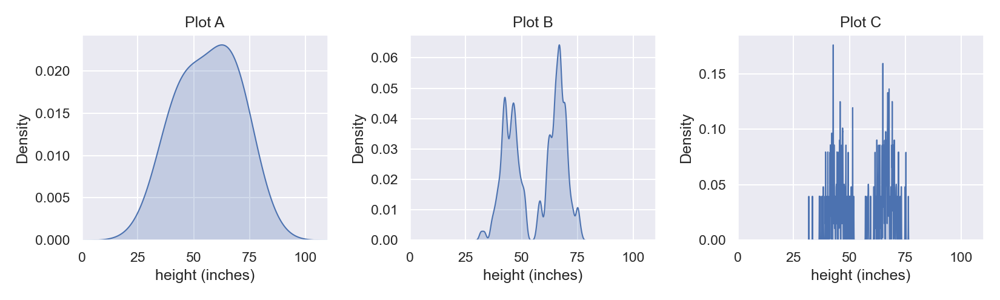
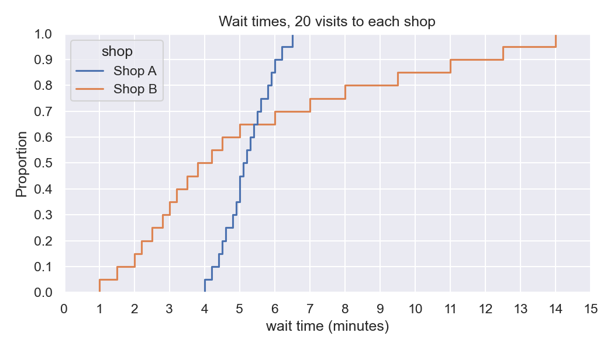
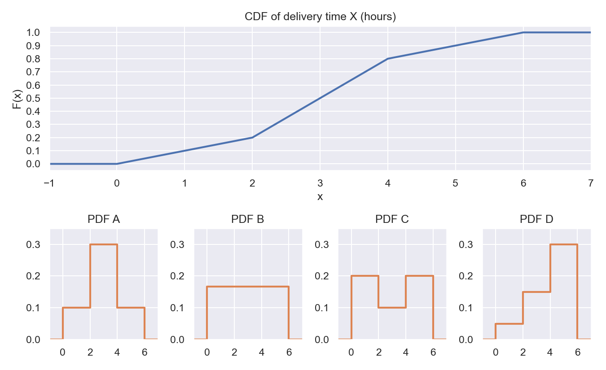
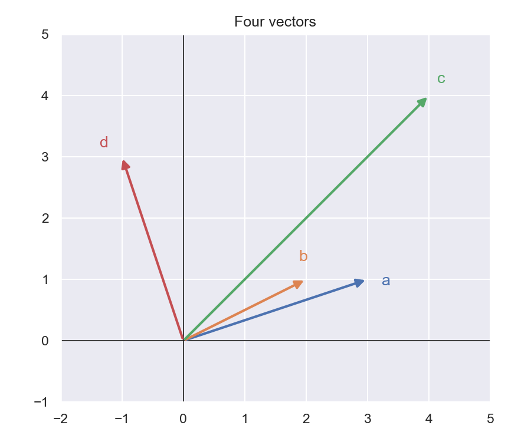
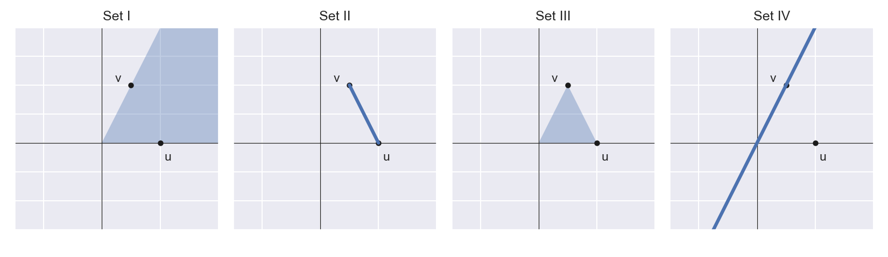
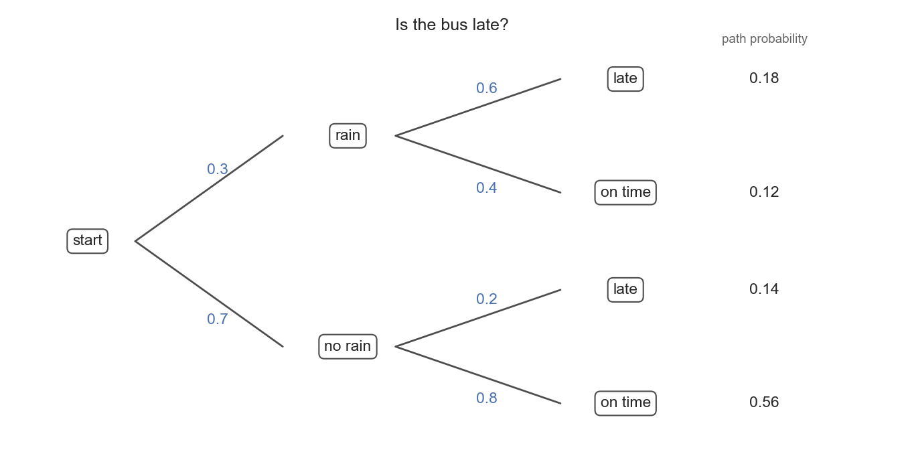
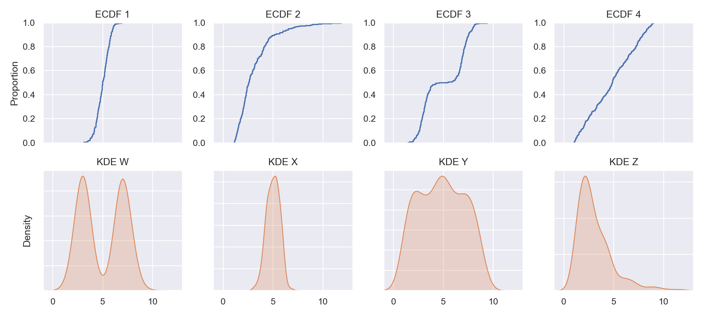

# Study Guide for midterm

You can have a cheat sheet for the exam, a normal 8.5x11 page front and back, handwritten. I want you to understand the concepts, not memorize and regurgitate facts.

## 1. Topics covered:

- Data wrangling
- Vectors and Linear algebra
- Probability
- Categorical variables
- ECDF
- CDF/PDF
- KDE

## 2. Important definitions

You should be able to give a ~1 sentence (or 1 mathematical statement) definition of each of the following.

- Random variable
- Probability space $(S,\mathcal{E},p)$
- Conditional probability
- Independence of events
- Inner product
- Orthogonality
- Covariance
- Cosine similarity
- PMF & PDF
- iid
- Binomial variables & Bernoulli trials
- Indicator function
- ECDF
- CDF
- Parameter, statistic, estimator
- KDE

## 3. Example problems

Here are some sample problems to go through for practice. If you can work through the homework problems and the quiz questions, you will do well (but honestly some of the homework problems are harder than what will be on the exam. The caliber of the exam questions will match the ones below.) The actual exam will be much shorter as well; this study guide is intended to be comprehensive, but it's not a practice exam per se.

### Short answer

Answer each question in one or two sentences.

- a. What is the difference between an outcome and an event? Give one example of each for rolling a six-sided die.
- b. What does it mean for an estimator $\hat{\theta}$ to be unbiased? Give the equation you would check.
- c. For a data-generating process, how is the CDF related to the PDF? For a sample from that process, how is the ECDF related to a KDE? How is the ECDF related to the CDF? How is the KDE related to the PDF?
- d. Why might you report the median instead of the mean? Why might you report the IQR instead of the standard deviation?
- e. A PDF value can be larger than 1, but a CDF value cannot. Explain why, and give an example of a PDF that takes a value larger than 1.
- f. You have a grid of K equally spaced values between $a$ and $b$. You draw a point from the grid at random with equal probability, and repeat this 10,000 times. What known distribution does your ECDF approach?
- g. You have the same grid of equally spaced values as in **f**, but this time you sample 5 numbers and take the mean. You repeat this 10,000 times. What known distribution does your ECDF of the sample mean approach?

### Data wrangling

**Problem 1.** A small dataset records each passenger's ticket class and whether they survived:

| passenger | class  | survived |
| --------- | ------ | -------- |
| 1         | first  | 1        |
| 2         | third  | 0        |
| 3         | second | 1        |
| 4         | third  | 0        |
| 5         | first  | 1        |
| 6         | third  | 1        |
| 7         | second | 0        |
| 8         | third  | 0        |

- a. One-hot encode `class` as a matrix with one column per class.
- b. Compute the mean of each column of your one-hot matrix. What do these numbers estimate?
- c. Compute `df.groupby('class')['survived'].mean()` by hand. Write each result as a conditional probability, $p[\,\text{survived} \mid \cdot\,]$.
- d. Estimate $p[\text{first} \mid \text{survived}]$. Is it equal to $p[\text{survived} \mid \text{first}]$?
- e. Based on these data, is surviving independent of being in third class? Check with the definition of independence.
- f. `X` is a NumPy array of shape `(8, 3)`, and `m = X.mean(axis=0)`. What is the shape of `m`? What is the shape of `X - m`, and what does broadcasting do to produce it?
- g. The full manifest also has an `age` column, and some ages are missing. A colleague fills every missing age with the median age. What does this do to the spread (variance) of `age`?
- h. Before filling them in, why might you add a column `age_NA` that records which ages were missing?

### Vectors and linear algebra

**Problem 2.** Consider the vectors

$$
a = \left[ \begin{array}{c} 3 \\ -1 \end{array} \right] \quad \text{and} \quad b = \left[ \begin{array}{c} w \\ 6 \end{array} \right]
$$

- a. Sketch $a$ and $b$ for $w = -4, 0, 4$.
- b. For what value of $w$ are $a$ and $b$ orthogonal? What is the angle between them at that value?
- c. For what value of $w$ are $a$ and $b$ linearly dependent (scalar multiples of each other)?
- d. Describe the span of $a$ and $b$ at your value from part c, and at any other value of $w$.

**Problem 3.** We have a query vector $q = [2, 1, 0]$ and two candidate vectors:

$$
a = [4, 4, 4], \quad b = [1, 0, 0]
$$

- a. Compute the dot product of $q$ with each candidate. Which candidate has the largest dot product?
- b. Compute the cosine similarity of $q$ with each candidate. Which candidate is most similar?
- c. Explain why parts a and b pick different candidates. What property of a vector inflates its dot product without making it more similar in direction?
- d. If you were building a search engine that retrieves documents similar to a query, which measure would you use, and why?

**Problem 4.** Let $X = [1, 2, 3, 4]$ and $Y = [3, 1, 4, 4]$.

- a. Center both variables to get $c_X$ and $c_Y$.
- b. Compute $\text{cov}(X, Y) = \dfrac{c_X \cdot c_Y}{N}$.
- c. Compute the cosine similarity of $c_X$ and $c_Y$. (This number is the correlation of $X$ and $Y$.)
- d. How does the covariance change if you add 10 to every value of $Y$? If you multiply every value of $X$ by 2? How does the correlation change in each case?
- e. Why is correlation easier to interpret than covariance? What are the units of correlation and what are the units of covariance?

### Probability

**Problem 5.** Flip a fair coin three times.

- a. Write out the sample space $\mathcal{S}$. How many outcomes does it have?
- b. Let $A$ = "at least two heads" and $B$ = "the first flip is heads." List the outcomes in $A$, in $B$, and in $A \cap B$.
- c. Compute $p[A]$, $p[B]$, $p[A \cap B]$, and $p[A \mid B]$.
- d. Are $A$ and $B$ independent? Check with the definition.
- e. Let $C$ = "the second flip is heads." Are $B$ and $C$ independent?
- f. Let $X$ be the number of heads. Write $X$ as a sum of indicator variables, one per flip.
- g. Write the PMF of $X$ and compute $\mathbb{E}[X]$.

**Problem 6.** An email provider estimates that 20% of incoming email is spam. Its filter flags 90% of spam messages and wrongly flags 5% of legitimate messages.

- a. Draw a probability tree that starts with whether a message is spam and then resolves whether it is flagged. Label every edge and give the probability of each path.
- b. What is $p[\text{flagged}]$?
- c. What is $p[\text{spam} \mid \text{flagged}]$?
- d. A different provider uses the same filter, but only 1% of its email is spam. Recompute $p[\text{spam} \mid \text{flagged}]$.
- e. The filter is equally accurate for both providers. Explain why your answers to c and d differ so much. What is this effect called?

**Problem 7.** A machine produces parts, and each part is defective with probability 0.1, independently of the others. You inspect 4 parts.

- a. Let $D_i = \mathbb{I}\{\text{part } i \text{ is defective}\}$. What distribution does each $D_i$ have? Are $D_1, \dots, D_4$ iid? Explain.
- b. Compute $\mathbb{E}[D_i]$.
- b. Let $X = D_1 + D_2 + D_3 + D_4$. What distribution does $X$ have?
- c. Compute $p[X = 0]$, $p[X = 1]$, and $p[X \ge 1]$.
- d. Compute $\mathbb{E}[X]$.

### Categorical variables, ECDF, and robust statistics

**Problem 8.** Consider the sample $X = [2, 5, 5, 7, 10]$.

- a. Compute and sketch the ECDF, $\hat{F}(x) = \frac{1}{n}\sum_{i=1}^n \mathbb{I}\{x_i \le x\}$.
- b. What are $\hat{F}(5)$ and $\hat{F}(1)$?
- c. Use the ECDF to estimate $p[4 < X \le 7]$.
- d. Why is the step at $x = 5$ twice as tall as the step at $x = 2$?
- e. Read the median off your sketch.
- f. Find the 0.8 quantile (the smallest $x$ with $\hat{F}(x) \ge 0.8$). In one sentence, what does it tell you about the sample?

**Problem 9.** Two groups of patients are compared by their ECDFs of survival time. The ECDF of group A lies *above* the ECDF of group B at every value of $x$.

- a. Sketch two ECDFs that fit this description.
- b. Which group tends to survive longer? Explain using what $\hat{F}(x)$ measures.
- c. Can you conclude that the difference between the groups is caused by the treatment group A received? Why or why not?

**Problem 10.** A poll asks $n$ people a yes/no question. Let $D_i = \mathbb{I}\{\text{person } i \text{ says yes}\}$, where the $D_i$ are iid Bernoulli($p$), and let the sample proportion be $\hat{p} = \frac{1}{n}\sum_{i=1}^n D_i$.

- a. What is $\mathbb{E}[\hat{p}]$? Is $\hat{p}$ an unbiased estimator of $p$?
- b. Each $D_i$ has variance $p(1-p)$, so the variance of the sample proportion is $V[\hat{p}] = \dfrac{p(1-p)}{n}$. Compute $V[\hat{p}]$ for $p = 0.2$ with $n = 100$, and again with $n = 400$.
- c. From part b, how much larger does $n$ need to be to cut the standard deviation of $\hat{p}$ in half?
- d. For a fixed $n$, which value of $p$ makes $V[\hat{p}]$ largest? Explain in words why a question with this value of $p$ is the hardest to estimate.

### CDF and PDF

**Problem 11.** A random variable $X$ has CDF

$$
F(x) = \begin{cases}
0, & x < 0\\
x^2, & 0 \le x \le 1\\
1, & x > 1
\end{cases}
$$

- a. Sketch $F$. Check that it satisfies the properties of a CDF.
- b. Compute $p[X \le 0.5]$.
- c. Find the PDF $f(x)$ and sketch it. Where is $X$ most likely to land?
- d. Let $Y = 3 + 2X$. Find $F_Y(y)$. What values can $Y$ take?

### KDE

**Problem 12.** Consider the sample $X = [1, 2, 2.5, 6]$ and the uniform kernel density estimator

$$
\hat{f}_h(x) = \frac{\sum_{i=1}^n \mathbb{I}\{|x - x_i| < h\}}{2nh}
$$

with bandwidth $h = 1$.

- a. Compute $\hat{f}_1(x)$ at $x = 0.5, 1.5, 2, 4, 6$.
- b. Sketch $\hat{f}_1(x)$ over $[-1, 8]$. (Hint: each data point contributes a box of width $2h$ and height $\frac{1}{2nh}$.)
- c. Show that $\hat{f}_1(2) = \dfrac{\hat{F}(3) - \hat{F}(1)}{2}$, where $\hat{F}$ is the ECDF. What does this say about how the KDE relates to the ECDF?

## Interpreting plots

**Problem 13.** Three Gaussian KDEs are drawn from the same sample of 200 heights, in inches. The KDEs are plotted with bandwidths (in some order) $h = 0.05$, $h = 0.8$, and $h = 10$.

- a. Match each plot to its bandwidth. What about each plot's shape gave it away?
- b. Plot B shows something about the people who were measured that Plot A hides. What is it?
- c. Are the spikes in Plot C real features of the heights? Which plot is undersmoothed and which is oversmoothed? For each, say whether its main problem is bias or variance.
- d. If you drew a new sample of 200 points from the same process and redrew all three plots, which plot would change the most? Why?
- e. Which plot would you put in a report, and why?

**Problem 14.** You have 20 visits' worth of wait times (in minutes) at each of two coffee shops near campus. Their ECDFs are below.

- a. Which shop is more predictable? What about the shape of its ECDF tells you that?
- b. The two ECDFs cross. What does the crossing tell you about the question "which shop is faster?"
- c. Your class starts in 6 minutes and being late is not an option. Which shop do you choose? Now suppose you have all morning and just want the shortest typical wait. Does your choice change? Explain both using the picture.
- d. A friend says "Shop B is faster, because its median is lower." What is the friend's summary missing?
- e. Shop B's curve is built from only 20 visits. Which part of its curve do you trust the least, and why?

**Problem 15.** A delivery company models its delivery time $X$ (in hours) with the CDF shown on top. Four candidate PDFs are shown below it.

- a. Which of PDFs A–D goes with this CDF? Explain why.
- b. In what range of hours are deliveries most likely to arrive? How can you see this in the CDF, and how can you see it in the PDF?
- c. The company advertises "most deliveries arrive within 4 hours." Does the CDF support that claim? Explain what you looked at.
- d. The CDF never goes down as $x$ increases. Why can't any CDF go down?

**Problem 16.** The plot shows four vectors $a$, $b$, $c$, and $d$. Both $b$ and $c$ point in roughly the same direction as $a$.

- a. Is the dot product of $a$ with each of $b$, $c$, and $d$ positive, negative, or zero? How can you tell from the picture?
- b. Which of $b$ and $c$ has the larger dot product with $a$? Which has the larger cosine similarity with $a$? Explain using the length and the direction of each vector.
- c. Why do the two measures pick different vectors?
- d. You are building a search engine and $a$ is the query. Which of $b$ and $c$ would a dot-product search return first, and which would a cosine-similarity search return first? Which result seems more like "similar to $a$"?
- e. If $c$ were shrunk to half its length, which of the two measures would change, and which would stay the same?
- f. What is the span of $a$ and $b$? Would it change if $b$ pointed exactly along $a$?

**Problem 17.** Each panel below shows a set built from two vectors, $u$ and $v$.

Match each of Sets I–IV to one description, and say what feature of the picture gave it away:

- (i) all convex combinations of $u$ and $v$;
- (ii) all combinations $su + rv$ with $s, r \ge 0$ (the cone);
- (iii) all multiples $sv$ for any real $s$ (the span of $v$ alone);
- (iv) all convex combinations of $0$, $u$, and $v$.

**Problem 18.** A commuter models whether their bus is late with the probability tree below. The first split is the weather; the second split is whether the bus is late.

- a. In words, what does the 0.6 on the edge from "rain" to "late" mean? What does the 0.18 at the end of that path mean? Why is the number at the end of the path smaller than the number on the edge?
- b. Explain how this tree represents conditional updating: what does each split condition on, and what new information does moving one level deeper give you?
- c. Looking only at the edge labels, does rain seem to affect whether the bus is late? How can you tell? What would the second level of the tree would look like if rain had no effect?
- d. You get to the stop and learn the bus is late. Which paths are still possible? Without calculating, is rain now more likely or less likely than it was before you knew the bus was late? Why?
- e. Why must the four path probabilities add up to 1?
- f. If you redrew the tree with the splits in the opposite order (late or on time first, then weather), which numbers would stay the same and which would change?

**Problem 19.** The top row shows the ECDFs of four samples, each with 300 points. The bottom row shows Gaussian KDEs of the same four samples, in a different order.

- a. Match each ECDF (1–4) to its KDE (W–Z). For each match, name the feature of the ECDF that gave it away.
- b. ECDF 3 has a nearly flat stretch in the middle. What does a flat stretch in an ECDF say about the data, and what does it look like in the KDE?
- c. ECDF 4 is close to a straight line. What does that say about the density?
- d. Where is the median of sample 3? Is it a good description of a "typical" value in that sample? Why or why not?
- e. For sample 2, would you expect the mean to be larger or smaller than the median? Explain using the shape of the KDE.
- f. Which ECDF rises the most steeply? What does that tell you about the spread of that sample?

## Interpreting the math

Each problem below shows a short derivation with numbered steps. You do not need to write any equations, just answer the interpretation questions.

**Problem 20.** Let $X_1, \dots, X_n$ be iid with CDF $F$, and let $M = \max(X_1, \dots, X_n)$ be the largest value. The CDF of the maximum is

$$
\begin{aligned}
F_M(x) &= p[M \le x] && \text{(1)}\\
&= p[X_1 \le x \text{ and } X_2 \le x \text{ and } \cdots \text{ and } X_n \le x] && \text{(2)}\\
&= p[X_1 \le x]\; p[X_2 \le x] \cdots p[X_n \le x] && \text{(3)}\\
&= F(x) \cdot F(x) \cdots F(x) = F(x)^n && \text{(4)}
\end{aligned}
$$

- a. What condition must be true to go from (2) to (3)? What about (3) to (4)?
- b. Step (2) replaces a statement about the maximum with a statement about every observation. Why are those the same event?

**Problem 21.** The shortcut formula for variance comes from

$$
\begin{aligned}
V[X] &= \mathbb{E}\big[(X - \mathbb{E}[X])^2\big] && \text{(1)}\\
&= \mathbb{E}\big[X^2 - 2X\,\mathbb{E}[X] + \mathbb{E}[X]^2\big] && \text{(2)}\\
&= \mathbb{E}[X^2] - 2\,\mathbb{E}[X]\,\mathbb{E}[X] + \mathbb{E}[X]^2 && \text{(3)}\\
&= \mathbb{E}[X^2] - \mathbb{E}[X]^2 && \text{(4)}
\end{aligned}
$$

- a. In step (3), what fact about $\mathbb{E}[X]$ allows us to separate the expectation from (2) into three pieces?
- b. Variance can never be negative. What does that tell you about $\mathbb{E}[X^2]$ compared with $\mathbb{E}[X]^2$? When are they equal?

**Problem 22.** The sample mean $\bar{X}_n = \frac{1}{n}\sum_{i=1}^n X_i$ is an unbiased estimator of $\mu = \mathbb{E}[X_i]$:

$$
\begin{aligned}
\mathbb{E}[\bar{X}_n] &= \mathbb{E}\Big[\tfrac{1}{n}\textstyle\sum_{i=1}^n X_i\Big] && \text{(1)}\\
&= \tfrac{1}{n}\textstyle\sum_{i=1}^n \mathbb{E}[X_i] && \text{(2)}\\
&= \tfrac{1}{n} \cdot n\mu && \text{(3)}\\
&= \mu && \text{(4)}
\end{aligned}
$$

- a. What does step (2) depend on? What about step (3)?
- b. Did this derivation use independence anywhere? What does that tell you about when the sample mean is unbiased?
- c. "Unbiased" is a statement about $\mathbb{E}[\bar{X}_n]$. What does it say about the one sample mean you computed from your data, and what does it not say?

**Problem 23.** The ECDF at a point $x$ is an unbiased estimator of the CDF at $x$:

$$
\begin{aligned}
\mathbb{E}\big[\hat{F}(x)\big] &= \mathbb{E}\Big[\tfrac{1}{n}\textstyle\sum_{i=1}^n \mathbb{I}\{X_i \le x\}\Big] && \text{(1)}\\
&= \tfrac{1}{n}\textstyle\sum_{i=1}^n \mathbb{E}\big[\mathbb{I}\{X_i \le x\}\big] && \text{(2)}\\
&= \tfrac{1}{n}\textstyle\sum_{i=1}^n p[X_i \le x] && \text{(3)}\\
&= \tfrac{1}{n} \cdot n F(x) = F(x) && \text{(4)}
\end{aligned}
$$

- a. What does each of steps (1)–(4) depend on?
- b. Step (3) turns the expected value of an indicator into a probability. Why is the expected value of an indicator equal to the probability of its event?
- c. The uniform KDE does *not* pass this test: $\mathbb{E}[\hat{f}_h(x)] \ne f(x)$ in general. In words, why does averaging over a window of width $2h$ cause that?
