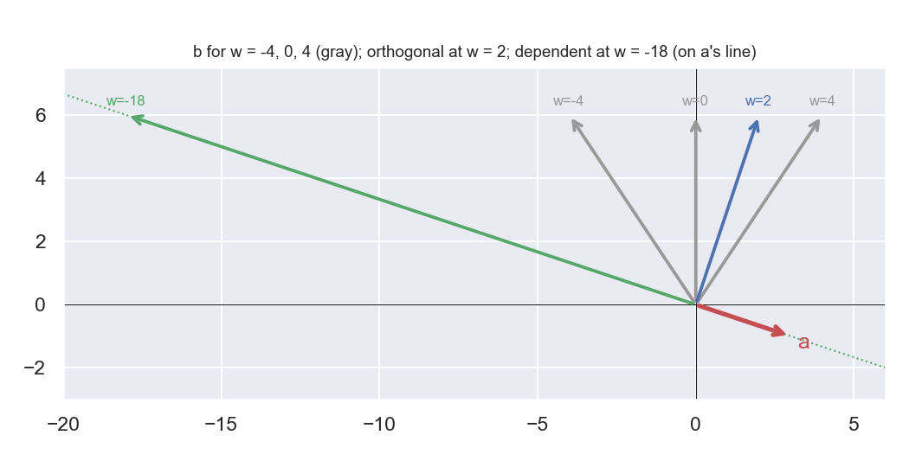
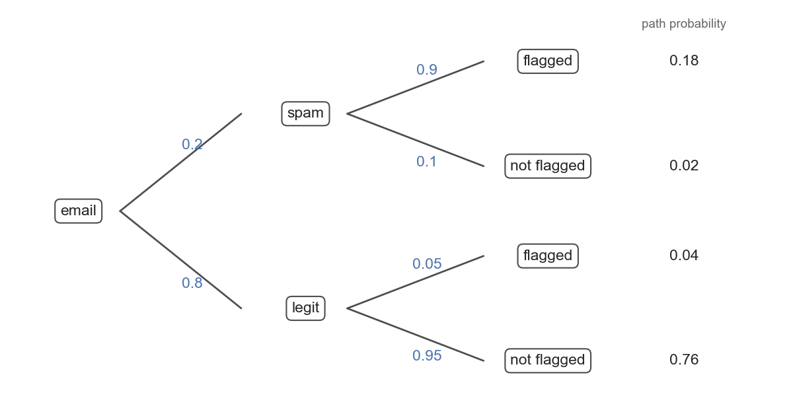
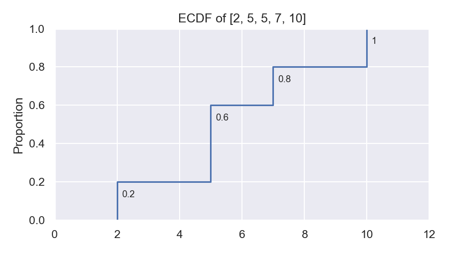
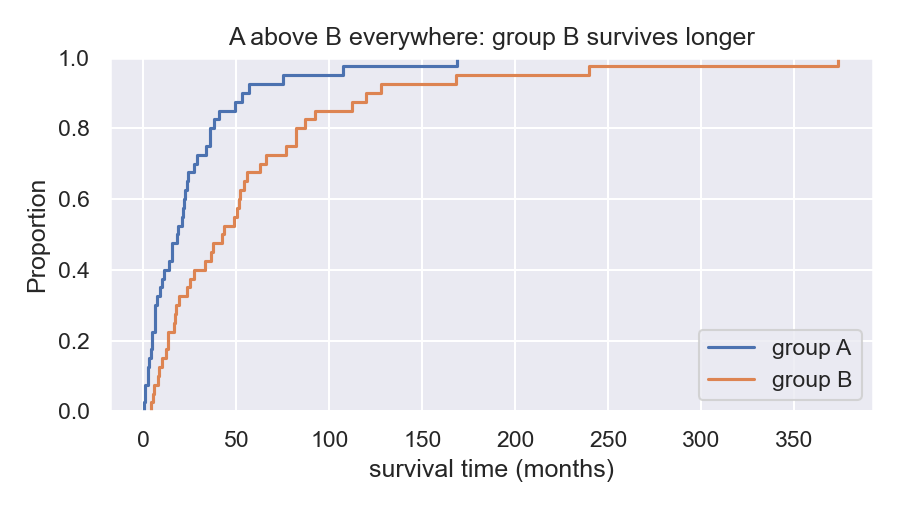
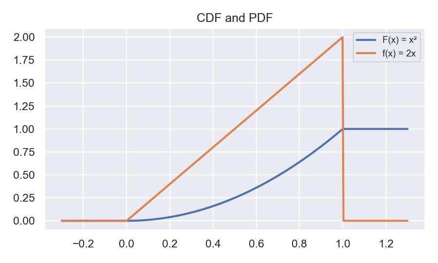
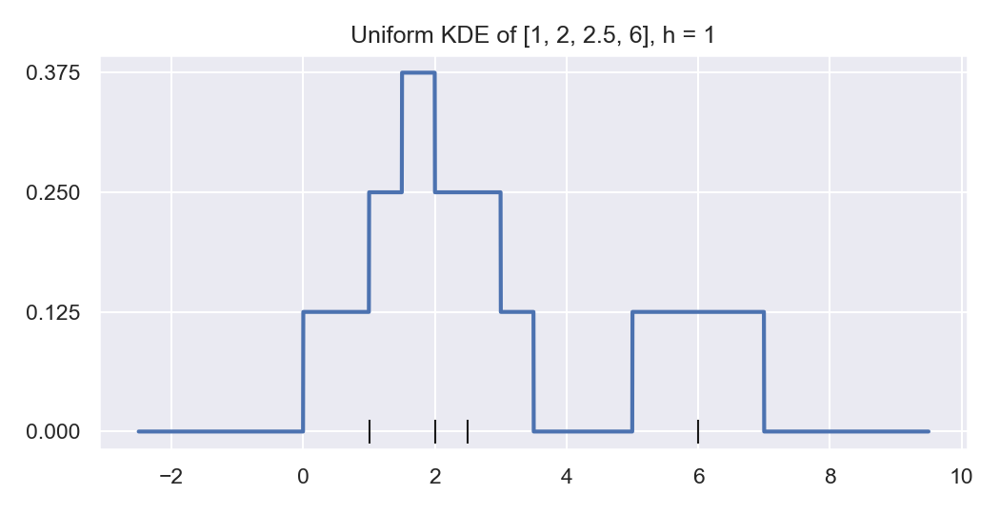

# MIDTERM STUDY GUIDE: Answer Key

Conventions: SD uses ddof = 0 (`np.std`); uniform KDE uses a strict window $|x-x_i|<h$; quantile $q$ = smallest $x$ with $\hat F(x)\ge q$.

---

## Short answer

- **a.** An outcome is a single element of $\mathcal S$ , a single thing that could happen (roll a 4); an event is a set of outcomes (roll an even number, $\{2,4,6\}$).
- **b.** $\mathbb E[\hat\theta]=\theta$: the expected value (average) of the estimator equals the true value.
- **c.** $F(x)=\int_{-\infty}^x f(t)\,dt$, so $f=F'$ (the PDF is the slope of the CDF; the CDF is the integral of the PDF). The KDE plays the role of $f$ for the ECDF: the uniform KDE is the slope of the ECDF over a window, $\hat f_h(x)=\dfrac{\hat F(x+h)-\hat F(x-h)}{2h}$ (up to the window's endpoints). The ECDF is an estimate of the CDF: unbiased, and it converges to $F$ as $n$ grows. The KDE is an estimate of the PDF: biased (it averages $f$ over a window of width $2h$) but consistent when $h\to0$ slowly as $n$ grows.
- **d.** The median and IQR are more robust statistics because they depend only on the order of the middle of the data, so outliers and skew barely move them; the mean and SD weight every value by its size.
- **e.** $F(x)$ is a probability, so it lies in $[0,1]$; $f(x)$ is probability per unit length ( a density), so it only has to integrate to 1. Uniform on $[0,0.5]$ has $f(x)=2$.
- **f.** Uniform CDF. 
- **g.** Normal CDF. This is the central limit theorem.

---

## Problem 1

**a.** Columns (first, second, third):

$$
\begin{bmatrix}1&0&0\\0&0&1\\0&1&0\\0&0&1\\1&0&0\\0&0&1\\0&1&0\\0&0&1\end{bmatrix}
$$

**b.** $(0.25,\ 0.25,\ 0.5)$: the sample proportions $\hat p[\text{first}],\hat p[\text{second}],\hat p[\text{third}]$.

**c.** first: $2/2=1.0=\hat p[\text{survived}\mid\text{first}]$; second: $1/2=0.5=\hat p[\text{survived}\mid\text{second}]$; third: $1/4=0.25=\hat p[\text{survived}\mid\text{third}]$.

**d.** 4 survivors, 2 in first class: $\hat p[\text{first}\mid\text{survived}]=0.5\ne 1.0=\hat p[\text{survived}\mid\text{first}]$.

**e.** $\hat p[\text{third}\cap\text{survived}]=1/8=0.125$, but $\hat p[\text{third}]\,\hat p[\text{survived}]=0.5\times0.5=0.25$. Not independent.

**f.** `m` has shape `(3,)`. `X - m` has shape `(8, 3)`: `m` is stretched across all 8 rows, so each column has its own mean subtracted (the columns are centered).

**g.** It shrinks the variance: every filled value sits exactly at the center, adding zero spread. (It also weakens age's correlation with other columns.)

**h.** Missingness can carry information (e.g., ages were missing more often for one class). The `age_NA` column keeps that information after the gaps are filled.

---

## Problem 2

**a.** Grey lines in the plot below.

**b.** $a\cdot b=3w-6=0\Rightarrow w=2$. (blue line in plot) The angle is $90^\circ$.

**c.** $b=ca$ requires $6=-c$, so $c=-6$ and $w=3c=-18$. (Green line in plot) Notice in the sketch that we fixed the second dimension value of $b$ at 6, so to find one that is linearly dependent on $a$, we extend the dotted line of our $a$ vector in both directions, and find the one that intersects the line $y=6$.

**d.** At $w=-18$: the span is the line $\{t\,[3,-1]^\top\}$ through the origin. At any other $w$: all of $\mathbb R^2$.

---

## Problem 3

**a.** $q\cdot a=8+4+0=12$, $q\cdot b=2$. $a$ is larger.

**b.** $\|q\|=\sqrt5$, $\|a\|=\sqrt{48}$, $\|b\|=1$.
$\cos(q,a)=12/\sqrt{240}=0.775$; $\cos(q,b)=2/\sqrt5=0.894$. $b$ is more similar.

**c.** The dot product grows with the length of both vectors, whereas cosine similarity normalizes by the lengths and therefore only represents how similar in direction two vectors are. $a$ is long but not well aligned.

**d.** Cosine similarity: it compares direction only, so long documents don't win just by being big.

---

## Problem 4

**a.** $m(X)=2.5$, $m(Y)=3$. $c_X=[-1.5,-0.5,0.5,1.5]$, $c_Y=[0,-2,1,1]$.

**b.** $c_X\cdot c_Y=0+1+0.5+1.5=3$; $\text{cov}=3/4=0.75$.

**c.** $\|c_X\|=\sqrt5$, $\|c_Y\|=\sqrt6$; $\text{corr}=3/\sqrt{30}=0.548$. Instead of dividing by N, like in b, we divide by both lengths, to get correlation.

**d.** For $Y+10$, $c_y$ is unchanged, so cov stays $0.75$. $2X$: $c_X$ doubles, so cov becomes $1.5$. Correlation stays $0.548$ in both cases.

**e.** Covariance carries the units of $X\times Y$; correlation is unit-free and lies in $[-1,1]$.

---

## Problem 5

**a.** $\mathcal S=\{HHH,HHT,HTH,HTT,THH,THT,TTH,TTT\}$, 8 outcomes.

**b.** $A=\{HHH,HHT,HTH,THH\}$; $B=\{HHH,HHT,HTH,HTT\}$; $A\cap B=\{HHH,HHT,HTH\}$.

**c.** $p[A]=1/2$, $p[B]=1/2$, $p[A\cap B]=3/8$, $p[A\mid B]=\dfrac{3/8}{1/2}=3/4$.

**d.** $3/8\ne1/4$: The probability of A and B does not equal the probability of A times the probability of B, so they are not independent.

**e.** $B\cap C=\{HHH,HHT\}$, $p=1/4=p[B]p[C]$. Independent.

**f.** $X=\mathbb I\{\text{flip 1}=H\}+\mathbb I\{\text{flip 2}=H\}+\mathbb I\{\text{flip 3}=H\}$.

**g.** $p_X(0)=1/8$, $p_X(1)=3/8$, $p_X(2)=3/8$, $p_X(3)=1/8$. $\mathbb E[X]=0+3/8+6/8+3/8=1.5$.

---

## Problem 6

**a.** Paths: spam & flagged $0.2\times0.9=0.18$; spam & not $0.2\times0.1=0.02$; legit & flagged $0.8\times0.05=0.04$; legit & not $0.8\times0.95=0.76$.

**b.** $p[\text{flagged}]=0.18+0.04=0.22$.

**c.** $p[\text{spam}\mid\text{flagged}]=0.18/0.22=0.818$.

**d.** $\dfrac{0.01\times0.9}{0.01\times0.9+0.99\times0.05}=\dfrac{0.009}{0.0585}=0.154$.

**e.** With a 1% base rate, the 5% false flags on the large pool of legitimate mail outnumber the true flags. Base rate fallacy.

---

## Problem 7

**a.** Each $D_i\sim\text{Bernoulli}(0.1)$. Yes, iid: same distribution, and independent by assumption.

**b.** $X\sim\text{Binomial}(4,0.1)$.

**c.** $p[X=0]=0.9^4=0.6561$; The probability of no successes is the probability of 4 failures, $p[D_i =0]=0.9$.

$p[X=1]=4(0.1)(0.9)^3=0.2916$;

$p[X\ge1]=1-0.6561=0.3439$.

**d.** $\mathbb E[X]=4\times0.1=0.4$.

---

## Problem 8

**a.**

$$
\hat F(x)=\begin{cases}0,&x<2\\0.2,&2\le x<5\\0.6,&5\le x<7\\0.8,&7\le x<10\\1,&x\ge10\end{cases}
$$

**b.** $\hat F(5)=0.6$, $\hat F(1)=0$.

**c.** $\hat F(7)-\hat F(4)=0.8-0.2=0.6$.

**d.** Two observations equal 5, so the jump there is $2/5$ instead of $1/5$.

**e.** Median $=5$.

**f.** $\hat F(5)=0.6<0.8$ and $\hat F(7)=0.8$, so the 0.8 quantile is $7$: 80% of the sample is at or below 7.

---

## Problem 9

**a.** Two staircases from 0 to 1, with A above B everywhere.

**b.** Group B. $\hat F_A(x)>\hat F_B(x)$ means a larger fraction of A has died by every time $x$.

**c.** No. This is observational: patients weren't randomly assigned, so a confounder (e.g., sicker patients receiving A) could explain the gap.

---

## Problem 10

**a.** $\mathbb E[\hat p]=\frac1n\sum\mathbb E[D_i]=\frac1n\cdot np=p$. Unbiased.

**b.** $n=100$: $V[\hat p]=0.2(0.8)/100=0.16/100=0.0016$. $n=400$: $V[\hat p]=0.16/400=0.0004$, one quarter as large (SD $0.04\to0.02$).

**c.** 4 times larger: SD $=\sqrt{p(1-p)/n}$ shrinks like $1/\sqrt n$.

**d.** $p=0.5$, where $p(1-p)=0.25$ is largest. An evenly split question gives the most variable answers from sample to sample; when nearly everyone answers the same way, every sample looks alike.

---

## Problem 11

**a.** $F$ is nondecreasing, $F\to0$ on the left, $F\to1$ on the right, continuous.

**b.** $p[X\le0.5]=0.25$. You can read this right off the CDF plot.

**c.** $f(x)=2x$ on $[0,1]$, 0 elsewhere. Largest near $x=1$ (the probability density is highest near 1.)

**d.** $F_Y(y)=p[3+2X\le y]=p\!\left[X\le\tfrac{y-3}{2}\right]$:

$$
F_Y(y)=\begin{cases}0,&y<3\\\left(\frac{y-3}{2}\right)^2,&3\le y\le5\\1,&y>5\end{cases}
$$

$Y\in[3,5]$.

---

## Problem 12

**a.** $\hat f_1(x)=\#\{|x-x_i|<1\}/8$. (Count the number within the bandwidth, and divide by 2nh.)

| $x$ | points in window | $\hat f_1(x)$ |
| ----- | ---------------- | --------------- |
| 0.5   | 1                | 0.125           |
| 1.5   | 1, 2             | 0.25            |
| 2     | 2, 2.5           | 0.25            |
| 4     | none             | 0               |
| 6     | 6                | 0.125           |

**b.** Boxes of height $1/8$ on $(0,2)$, $(1,3)$, $(1.5,3.5)$, $(5,7)$:

| region      | $\hat f_1$ |
| ----------- | ------------ |
| $(0,1]$   | 0.125        |
| $(1,1.5]$ | 0.25         |
| $(1.5,2)$ | 0.375        |
| $[2,3)$   | 0.25         |
| $[3,3.5)$ | 0.125        |
| $[3.5,5]$ | 0            |
| $(5,7)$   | 0.125        |
| elsewhere   | 0            |

**c.** $\hat F(3)=3/4$, $\hat F(1)=1/4$; $(3/4-1/4)/2=0.25=\hat f_1(2)$. The uniform KDE is the ECDF's rise over the window $[x-h,x+h]$ divided by its width $2h$: the slope of the ECDF.

---

## Problem 13

Plot-interpretation problems (P13–P19) take no calculation; answers are what a full-credit explanation says.

**a.** A: $h=10$ (one smooth hump; each bump is wider than the whole data range). B: $h=0.8$ (a few smooth features). C: $h=0.05$ (a spike at nearly every recorded height; each bump is narrower than the gaps between data points).

**b.** Two groups: children (around 44 in) and adults (around 66 in). A blurs them into one.

**c.** No: each spike sits on individual observations. C is undersmoothed/overfit (variance problem); A is oversmoothed/underfit (bias problem).

**d.** C: its spikes sit on individual points, so every new sample moves them. A barely changes.

**e.** B: it shows the real two-group structure without spikes that are artifacts of this particular sample.

---

## Problem 14

**a.** Shop A: its ECDF climbs from 0 to 1 over a narrow range (about 4–6.5 min), so waits are consistent. Shop B's ECDF climbs slowly over 1–14 min.

**b.** Neither shop is faster at every threshold. B is more likely to give a very short wait, and A is more likely to keep the wait under about 5–6 min.

**c.** In a hurry: A. At 6 min, A's curve is near the top and B's is well below it, so B has a real chance of a long wait. With all morning: B, because its middle sits to the left of A's, so its typical wait is shorter.

**d.** The spread and the long right tail. A lower median says nothing about how bad the bad days are.

**e.** The upper right tail (long waits): only a handful of the 20 visits land there, so each step is one visit.

---

## Problem 15

**a.** PDF A. The CDF is shallow on $[0,2]$, steepest on $[2,4]$, and shallow again on $[4,6]$; A is low, high, low. (B would make the CDF one straight line; C would make it flattest in the middle; D would make it steepest at the end.)

**b.** Between 2 and 4 hours. In the CDF, the curve rises fastest there; in the PDF, the bar is tallest there.

**c.** Yes: at $x=4$ the CDF is about 0.8, so well above 50% of the time the wait is less than 4 hours.

**d.** $F(x)=p[X\le x]$. Raising $x$ only adds outcomes to the event, so the probability can't shrink.

---

## Problem 16

**a.** $b$ and $c$: positive, since each is less than $90^\circ$ from $a$. $d$: zero, since it meets $a$ at a right angle (orthogonal).

**b.** Larger dot product: $c$. Larger cosine similarity: $b$. $c$ is much longer but points further from $a$; $b$ is short but almost exactly along $a$. ($a\cdot b=7$, $a\cdot c=16$; cosines $0.99$ vs. $0.89$.)

**c.** The dot product grows with length and angle together; cosine similarity divides out length and keeps only the angle.

**d.** Dot product returns $c$; cosine similarity returns $b$. Cosine's answer is more like "similar": $b$ points the same way as $a$, and $c$ wins the dot product mostly by being long.

**e.** The dot product halves; cosine similarity is unchanged (the direction is the same).

**f.** The whole plane, because $a$ and $b$ point in different directions. If $b$ pointed exactly along $a$, the span would shrink to the line through $a$.

---

## Problem 17

I = (ii) cone: a wedge between the rays through $u$ and $v$ that extends forever.

II = (i): just the segment connecting $u$ and $v$.

III = (iv): the filled triangle with corners $0$, $u$, $v$.

IV = (iii): a line through the origin and $v$, extending both ways.

---

## Problem 18

**a.** 0.6: *if it rains*, the bus is late 60% of the time, $p[\text{late}\mid\text{rain}]$. 0.18: the fraction of all days that are both rainy and late, $p[\text{rain}\cap\text{late}]$. It is smaller because it also accounts for rain happening only 30% of the time.

**b.** The first split sets probabilities with no information. Each edge at the second level is conditioned on the branch you are on. Moving to right in the tree means updating the probability of lateness after learning the weather.

**c.** Yes: late is 0.6 on the rain branch vs. 0.2 on the no-rain branch. With no effect, both branches would carry the same late/on-time labels.

**d.** Only the two "late" paths (0.18 and 0.14). Rain becomes more likely than 0.3: the rainy-late path is a larger share of the late paths than rain was of all days, because rain makes lateness more likely.

**e.** The paths are separate outcomes, and together they cover everything that can happen.

**f.** The four path probabilities stay the same (they are joint probabilities of the same events). The edge labels change, because they condition on different things.

---

## Problem 19

**a.** 1–X (steep rise in a narrow range, so one narrow peak).

2–Z (fast rise then a long slow approach to 1, so a right tail).

3–W (two steep stretches separated by a flat stretch, so two humps).

4–Y (nearly straight, so flat).

**b.** Almost no observations in that range. In the KDE it is the dip between two humps.

**c.** A constant slope means roughly constant density: the data are spread about evenly over the range.

**d.** Near 5, in the flat stretch: almost no observations are near the median, so it is not typical; the sample is really two groups.

**e.** Larger: the long right tail pulls the mean to the right of the median.

**f.** ECDF 1: it goes from 0 to 1 over the shortest range, so it has the smallest spread.

---

---

## Problem 20

**a.** (2) to (3): independence (the probability that all happen is the product). (3) to (4): identically distributed (every factor is the same $F(x)$).

**b.** If the largest value is at most $x$, every value is; if every value is at most $x$, so is the largest.

---

## Problem 21

**a.** $\mathbb E[X]$ is a fixed number, not random, so linearity lets it factor out like any constant.

**b.** $\mathbb E[X^2]\ge\mathbb E[X]^2$. They are equal only when $V[X]=0$, i.e., $X$ is a constant.

---

## Problem 22

**a.** (2): linearity of expectation. (3): identically distributed, so each $\mathbb E[X_i]=\mu$.

**b.** No. Unbiasedness needs only linearity and a common mean; it holds even for dependent data.

**c.** On average over repeated samples, $\bar X_n$ lands on $\mu$. It says nothing about how close your one sample mean is.

---

## Problem 23

**a.** (1) Definition of the ECDF. (2) Linearity of expectation. (3) The expectation of an indicator is the probability of its event. (4) Identically distributed: each probability is $F(x)$.

**b.** An indicator is 1 with probability $p[A]$ and 0 otherwise, so its average is $1\cdot p[A]+0\cdot(1-p[A])=p[A]$.

**c.** It estimates the average density over $[x-h,x+h]$, not the density at $x$. Wherever $f$ curves, that window average differs from $f(x)$.
